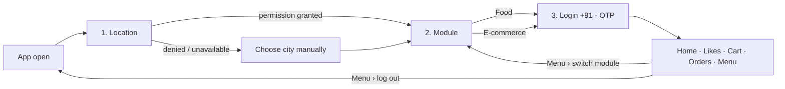
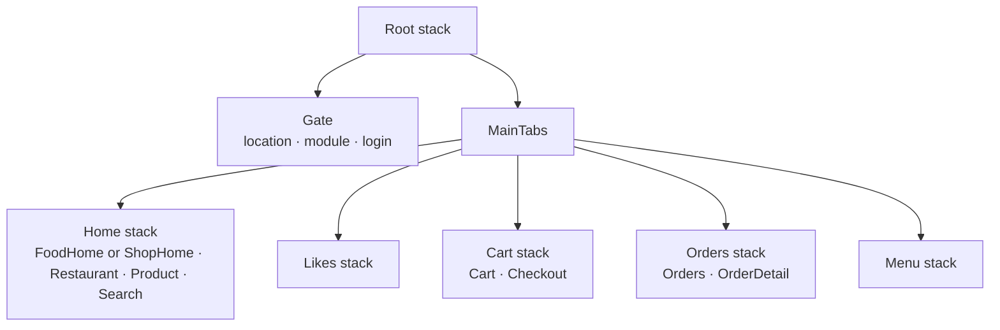

# Aurasure

A food-delivery **and** e-commerce super app in one Expo install. You pick a module on the way in — Food or E-commerce — and the whole app (home, search, likes, cart, orders) shows only that module's content, while the bottom tab bar stays identical in both.

The app ships fully functional on typed **mock data** and can switch to the real
**Aurasure API server** (`server/` in this repo) with one env var — see
[Connecting the API](#connecting-the-api). JSON-based images from the server
render through the same `SmartImage` component.

[](https://docs.expo.dev)
[](https://reactnative.dev)
[](https://www.typescriptlang.org)

---

## Flow





## Try it

```bash
git clone https://github.com/deepak748030/Aurasure.git
cd Aurasure/AurasureApp        # the Expo project lives in this folder
npm install
npx expo start          # then press a / i, or scan the QR in Expo Go
```

There is no SMS or auth backend, so on the OTP step the code is printed on the
screen ("Demo build — your OTP is …"); `123456` is always accepted. If location
permission is denied or unavailable, the gate falls back to a city grid instead
of blocking the app.

### Scripts

| Command | What it does |
| --- | --- |
| `npm start` | `expo start` (dev server) |
| `npm run android` / `ios` / `web` | start and open the target platform |
| `npm run typecheck` | `tsc --noEmit` — must stay clean, strict mode on |
| `npm run doctor` | `expo-doctor` dependency/config audit |
| `npm run export` | `expo export --platform ios` (static bundle, also used for CI checks) |

## Project structure

```
src/
├─ App.tsx                  providers + splash/font bootstrap
├─ assets.ts                local image registry: WebP artwork + the brand PNGs (icon, lockups)
├─ components/
│  ├─ ui/                   Screen, Card, Button, Input, TabBar, BottomSheet, Skeleton,
│  │                        SmartImage, SearchBar, Chip, Badge, Rating, Price, IconBox,
│  │                        SystemBarHost (status bar + nav bar colour owner), …
│  ├─ common/               BannerCard (full-bleed), Grid (2/3 col)
│  ├─ food/                 RestaurantCard, DishCard, FoodCategoryPills
│  └─ shop/                 ProductCard, ShopCategoryCard
├─ context/
│  ├─ AppContext.tsx        module · city · location status · session · wishlist
│  └─ CartContext.tsx       reducer-based cart (both modules coexist)
├─ data/mock.ts             6 restaurants · 24 dishes · 24 products · 8+8 categories ·
│                           4 banners · 3 orders, plus lookups and search helpers
├─ hooks/
│  ├─ useMockQuery.ts       simulated latency → skeleton, plus pull-to-refresh
│  ├─ useModuleCart.ts      cart lines/count/subtotal for the active module only
│  └─ useBottomInset.ts     tab-bar-aware bottom insets
├─ lib/
│  ├─ icons.tsx             IconName → MaterialCommunityIcons glyph registry
│  ├─ location.ts           permission → position → reverse geocode (never throws)
│  ├─ fonts.ts              Plus Jakarta Sans from the @expo/google-fonts CDN
│  ├─ format.ts             ₹ money, ratings, minutes, distance
│  ├─ haptics.ts            guarded expo-haptics presets
│  ├─ systemBars.ts         per-screen app-bar surface → notification bar colour + contrast
│  ├─ color.ts              luminance helper behind that contrast choice
│  └─ layout.ts             tab bar constants
├─ navigation/              AppNavigator, typed routes, deep-link helpers
├─ screens/                 12 screens (gate, food, shop, likes, cart, checkout,
│                           orders, search, menu)
├─ theme/                   colors.ts (light palette + module accents), tokens.ts
└─ types/index.ts           domain model: FoodItem, Restaurant, Product, CartItem, Order, …
```

## Design system

Flat by construction: there is **no** `shadow*` / `elevation` anywhere in `src`,
and the navigators set `shadowEnabled: false` + `headerShadowVisible: false` so no
platform elevation can creep in. Separation comes from tint (`surface` white on a
`#F6F7FB` background) and hairline rules.

`src/theme/tokens.ts` holds the whole visual scale — one edit re-themes the app:

| Token | Value | Notes |
| --- | --- | --- |
| `layout.contentHorizontalPadding` | `4` | the only side gutter in the app (screens, rows, sheets, floating bars) |
| `radius` | `4 / 8 / 12 / 16 / 20 / 26`, `pill` | fields, rows and cards use `md`-`xl`; every CTA and chip is `pill` |
| `spacing` | `4 → 32`, `section: 24` | |
| typography | `display … overline` | Plus Jakarta Sans, 5 weights |
| module accents | Food coral `#FF6A3D`, Store indigo `#5B46E5` | active tab tint follows the module |

Other rules the code actually enforces:

- **Banners are full-bleed** — `BannerCard` cancels the gutter with a negative margin and drops its side radius, so artwork touches both device edges (`fullBleed={false}` opts out).
- **System bars belong to the app** — `Screen` paints an app-bar strip behind the transparent
  status bar (`appBarColor`, defaults to the tab-bar plum; pass a hero colour to bleed it in) and
  reports it to `lib/systemBars.ts`, so the notification bar always matches the screen and the
  icon/clock contrast is derived from that colour instead of being hard-coded.
- **Safe areas are handled once** — `Screen` wraps header + body in `SafeAreaView` (top/left/right); bottom spacing reads `BottomTabBarHeightContext` instead of hard-coding the bar height, so nothing pays the bottom inset twice and the floating cart bars sit where they should.
- **Lists are tight** — horizontal rows use `gap: 0` containers with explicit per-item margins, grids use percentage widths, and rows inside a card are split by hairline dividers rather than by nesting cards.

### Icons

`src/lib/icons.tsx` exposes one `<Icon name size color filled style />` component over
**MaterialCommunityIcons** (ships with Expo — no extra native module, no font download).
The 109-key registry is `[solid, outline]` per icon: the outline twin renders by default,
`filled` renders the solid glyph (focused tab, favourited item, rating star). `IconName`
is a literal union, so an unknown icon name is a compile error.

## Module matrix

| Surface | Food module | E-commerce module |
| --- | --- | --- |
| Home | restaurants, dish bestsellers, category pills | banners, category tiles, trending/for-you products |
| Detail | Restaurant → menu, veg/non-veg marks, add to cart | Product → colours/sizes, stock, add to cart |
| Search | dishes + restaurant names only | products + brands only |
| Likes | saved dishes | saved products |
| Cart / Checkout | that module's lines, delivery fee, coupon, wallet/UPI/card/COD | same, own lines |
| Orders | `order.module === 'food'` | `order.module === 'shop'` |
| Tab bar | Home · Likes · Cart · Orders · Menu | identical |

## Data model & state

- `AppContext` — selected `module`, `city`, `locationStatus` (`unanswered → loading → granted|denied`), session (`phone`, `name`), per-module wishlist, and the derived `gate` step (`location → module → login → ready`). Logging out resets it, so the gate re-runs.
- `CartContext` — `add / setQty / remove / clear` over a `CartItem[]` tagged `kind: 'food' | 'shop'`. `useModuleCart()` filters it so a screen never mixes the two carts, and finishing an order clears only the active module's lines.
- `useAppQuery(fetcher, fallback, { deps })` — every screen mounts with a ~900 ms skeleton pass and supports pull-to-refresh. With no API URL it behaves exactly like the old `useMockQuery`; with a URL it fetches from the server and **falls back to the mock producer** on any failure, so screens never break.
- State is intentionally **in-memory** (cart/wishlist/session): reloading the app replays the gate. Persistence (AsyncStorage/MMKV + real auth) is the obvious next step.

## Connecting the API

The app uses **mock data unless you give it a server URL** — perfect for demos,
previews and offline work. Point it at the Aurasure backend (`server/` folder)
and every screen fetches live data instead, **falling back to mock silently**
if the server is unreachable or the database is still connecting.

1. Start the backend (see `server/README.md`):
   ```bash
   cd ../server
   cp .env.example .env      # default: port 5000
   docker compose up -d mongo
   npm run seed
   npm start
   ```
2. Create the app's env file (already included in the repo, git-ignored):
   ```bash
   cp .env.example .env      # in AurasureApp/
   ```
3. Set the URL (leave empty to stay on mock data):
   ```dotenv
   EXPO_PUBLIC_API_URL=http://localhost:5000
   EXPO_PUBLIC_API_PHONE=9876543210      # demo account from `npm run seed`
   EXPO_PUBLIC_API_PASSWORD=aurasure123
   ```
4. Restart Metro (`npx expo start -c` or `npm run web`) so Expo picks up `.env`.

What connects: homes (food + shop), restaurant/store/category/product pages,
search, likes, profile greeting, checkout addresses, order placement and order
history. Images come from the server as `{ kind: 'uri', uri }` refs and render
with the existing `SmartImage`. Likes state and cart stay local by design;
favorites synchronise to the server later.

## Brand assets

Every logo, icon and splash bitmap is generated from one vector definition in
`scripts/generate-brand.mjs` — the "aura arch" A (rounded arch + crossbar wrapped in two aura
arcs) in the brand indigo→violet from `src/theme/colors.ts`. Never hand-edit the PNGs; change
the geometry or colours in the script and re-run it.

```bash
mkdir -p /tmp/brand && cd /tmp/brand
npm i @resvg/resvg-js sharp @expo-google-fonts/manrope     # generator-only, not app deps
BRAND_DEPS=$PWD node <repo>/AurasureApp/scripts/generate-brand.mjs
```

| File | Size | Used by |
| --- | --- | --- |
| `icon.png` | 1024² opaque | iOS app icon, Android legacy icon, store listings |
| `adaptive-icon.png` | 1024² alpha | Android adaptive foreground (glyph inside the 66% safe zone) |
| `adaptive-icon-background.png` | 1024² opaque | Android adaptive background (gradient) |
| `adaptive-icon-monochrome.png` | 1024² alpha | Android 13+ themed icons |
| `splash-icon.png` | 1200² alpha | `expo-splash-screen` (vertical lockup) |
| `favicon.png` | 96² | web |
| `logo_aurasure[_light].png` | 3.76:1 | horizontal lockup — `Images.logo` / `Images.logoLight` |
| `logo_mark[_light].png` | 1:1 | square mark — `Images.logoMark`, for square slots |
| `logo_aurasure_stacked.png` | 1:1 | vertical lockup — `Images.logoStacked` |

The wordmark is 3.76:1: put it in a box with that ratio (or `contentFit="contain"`). Square
slots take `logoMark`, never the wordmark.

## Known limitations
- Mock data only when no URL is configured (or the server is down); no payments, no SMS, no order webhooks.
- `SmartImage` renders a tinted icon placeholder for the 35 mock entries that have no image — drop a file in `src/assets/images` and wire it in `src/assets.ts` and it lights up.
- Fonts are fetched from a CDN on first run; offline the app falls back to system fonts.
- Edge-to-edge is mandatory on Android 16, so `NavigationBar.setBackgroundColorAsync` is not used (it is a no-op there); the app paints both strips itself.
- Local art ships as WebP (quality 78, resized to what the UI draws at); the brand marks stay
  PNG because they need alpha and because `expo-splash-screen` and the Android adaptive icon
  only accept PNG. Total `assets/` is ~0.6 MB, down from ~18 MB.

## Troubleshooting

| Symptom | Fix |
| --- | --- |
| Metro serves a stale bundle after a merge | `npx expo start -c` |
| `Unable to resolve module ./Libraries/Text/…` from `react-native` | mixed `node_modules`: `rm -rf node_modules package-lock.json && npm install`, then keep the RN version in sync with `expo` (SDK 54 ⇒ RN 0.81.5 / React 19.1.0) |
| Same error on a project inside OneDrive/Dropbox | sync placeholders break Metro — move the repo out of the synced folder or mark it "Always keep on this device" |
| `Cannot find module 'babel-preset-expo'` | `npm i -D babel-preset-expo` (npm sometimes nests it under `expo/`) |
| Location prompt never appears in a custom dev build | `expo-location` is native — rebuild (`npx expo run:android` or `eas build --profile development`). Without it the gate safely falls back to the city grid |
| Version drift after an Expo upgrade | `npx expo install --check` |

## Roadmap

- Persist session, module, city, likes and cart (AsyncStorage or MMKV)
- Real OTP (Expo + a phone-auth backend) and address geocoding
- Order tracking over a subscription/push, plus a checkout receipt PDF
- Split the mock layer behind a query client (TanStack Query) so screens keep their loading states
- Dark theme (the palette is already centralised in `src/theme/colors.ts`) and `react-native-screens` modal presentation for the sheets

---

Built as a single-owner side project — issues and PRs welcome.
