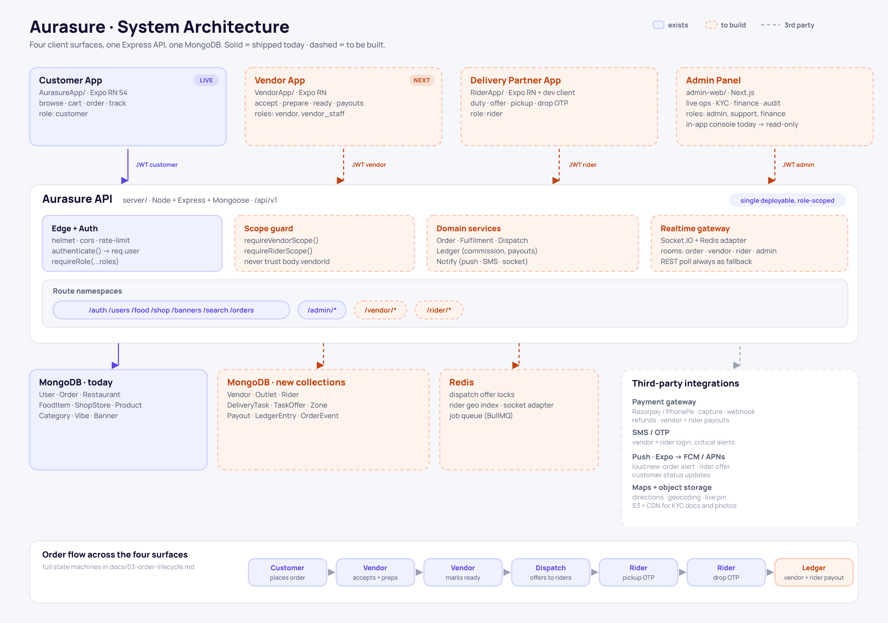
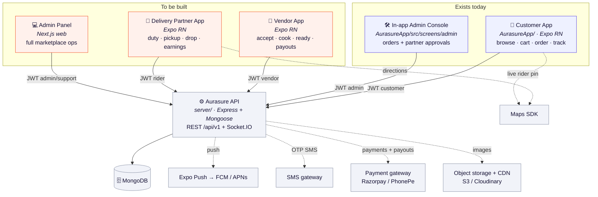
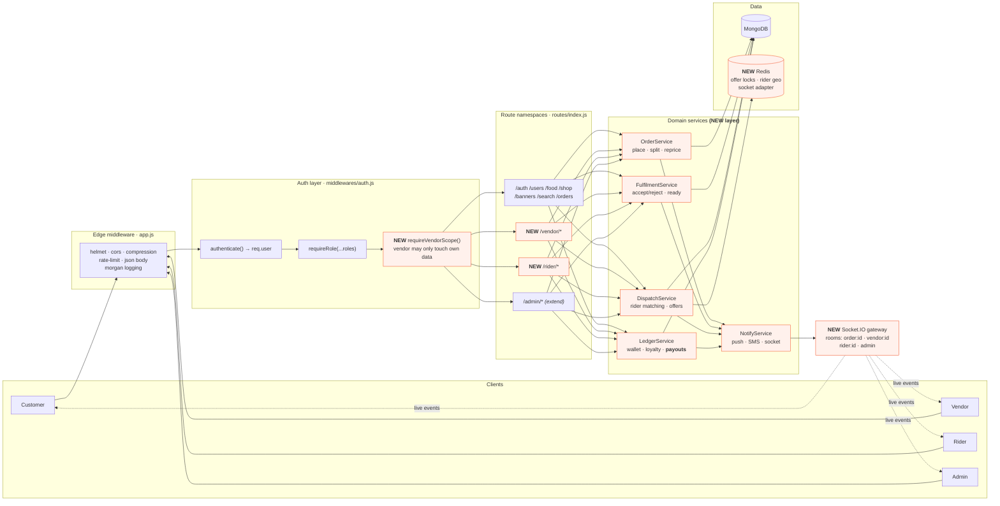
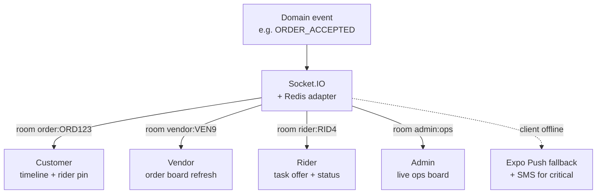
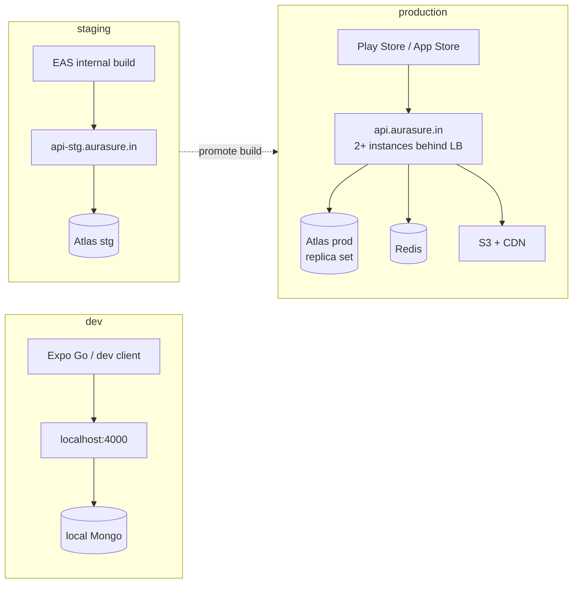

# 01 · System Architecture



*Rendered from [`diagrams/render.mjs`](./diagrams/render.mjs). The Mermaid graphs below are the
editable source of truth for detail; the PNG is the cover map.*

## 1.1 Context — who talks to what

Four client surfaces, one API, one database. Today only the two on the left exist.



> **Decision — why the admin panel moves to web.** The in-app console (added in PR #8) is fine for
> a founder checking orders on a phone. Real ops (catalogue moderation, payout runs, dispute
> handling, CSV exports, multi-window live board) need a keyboard, a big screen and printing. Keep
> the in-app console as a **read-only mobile view**; build the operational panel as a web app.

## 1.2 Containers — inside the API



**What is genuinely new:** a thin service layer (controllers today hold the logic — fine for one
client, unmanageable across four), a dispatch engine, a payout ledger, and a realtime gateway.
Everything else is the existing Express app extended.

## 1.3 Realtime — who subscribes to which room

Polling is what the customer app does today. With three operational clients it stops being viable:
a vendor must hear a new order within ~2 seconds, and a customer expects the rider pin to move.



| Event | order room | vendor room | rider room | admin room | Push? |
| --- | :-: | :-: | :-: | :-: | --- |
| `order.placed` | ✓ | ✓ | – | ✓ | Vendor: **loud alert** |
| `order.accepted` / `rejected` | ✓ | ✓ | – | ✓ | Customer |
| `order.ready` | ✓ | ✓ | ✓ | ✓ | Rider |
| `dispatch.offer` | – | – | ✓ | ✓ | Rider: **loud alert, 30 s TTL** |
| `dispatch.assigned` | ✓ | ✓ | ✓ | ✓ | Customer + Vendor |
| `rider.location` (throttled 5 s) | ✓ | – | – | ✓ | no |
| `order.delivered` | ✓ | ✓ | ✓ | ✓ | Customer |
| `payout.settled` | – | ✓ | ✓ | ✓ | Vendor / Rider |

**Fallback rule:** every screen that consumes a socket event must also work on a 15 s poll of the
same REST endpoint. Sockets are an optimisation, never the only path — that keeps the apps usable
on flaky Indian mobile networks.

## 1.4 Repository layout (proposed)

```
Aurasure/
├─ AurasureApp/          customer app          (exists)
├─ VendorApp/            NEW · Expo RN
├─ RiderApp/             NEW · Expo RN
├─ admin-web/            NEW · Next.js
├─ packages/
│  ├─ ui/                NEW · shared theme + components, extracted from AurasureApp
│  └─ api-client/        NEW · typed fetch layer + shared DTO types
├─ server/               API                   (exists)
└─ docs/                 this folder
```

> **Decision — separate binaries, shared design system.** One app with a role switch is tempting
> but wrong: store listings, permissions, app size, review cycles and crash budgets all differ per
> audience, and a rider must never be one toggle away from vendor data. Share `packages/ui` so the
> brand (doc: `AurasureApp/README.md` → Brand assets) stays identical across all four surfaces.

## 1.5 Environments & deployment



Non-negotiables before production: sticky sessions **or** the Redis Socket.IO adapter (multi
instance breaks rooms otherwise), Atlas backups + point-in-time restore, structured JSON logs with
a request id, Sentry in all four clients, and a health check per instance (`/api/v1/health`
already exists).
