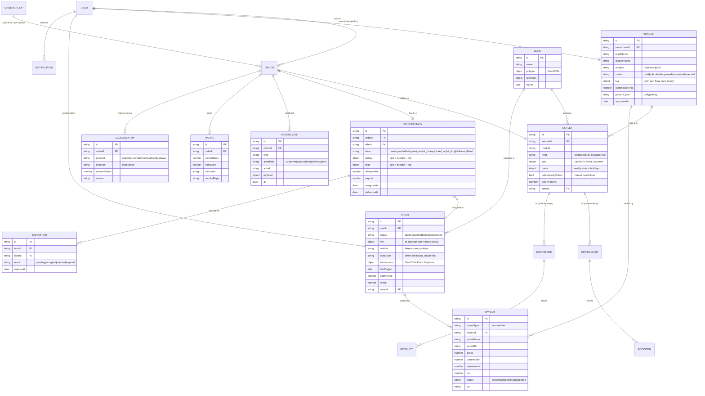
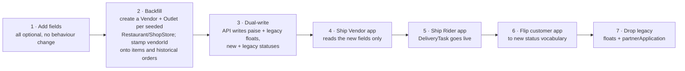

# 02 · Data Model

Current collections (`server/src/models/`): `User`, `Order`, `Restaurant`, `FoodItem`,
`FoodCategory`, `FoodVibe`, `ShopStore`, `Product`, `ShopCategory`, `Banner`.

The marketplace needs **9 new collections** and **field additions to 5 existing ones**. Nothing
below removes a field — the customer app keeps working through the whole migration.

## 2.1 Target ER diagram



## 2.2 Changes to existing collections

### `User` — `server/src/models/User.js`

| Change | Why |
| --- | --- |
| `role` enum `customer\|admin` → **`customer\|vendor\|vendor_staff\|rider\|admin\|support`** | Only two roles exist today; `requireRole()` already accepts a list, so the guard needs no change. |
| add `vendorId`, `riderId` (denormalised pointers) | Lets `authenticate()` attach scope in one query instead of a lookup per request. |
| add `pushTokens: [{ token, platform, appId, updatedAt }]` | Four apps → the same human can hold several tokens; `appId` keeps vendor pushes off the customer app. |
| add `lastLoginAt`, `isBlocked`, `blockReason` | Support and fraud handling. |
| **deprecate** `partnerApplication` (Mixed blob) | Today it is `{kind, name, city, appliedAt, status}` — no documents, no bank details, not queryable. Replaced by real `Vendor.kyc` / `Rider.kyc`. Migrate then keep read-only for one release. |

### `Order` — `server/src/models/Order.js`

| Change | Why |
| --- | --- |
| add **`vendorId` + `outletId`** (indexed) | **The single biggest blocker.** An order today knows its items but not who must cook them; a vendor app literally cannot query "my orders". |
| add `groupId` (→ `OrderGroup`) | A cart may hold items from two restaurants; one order per vendor, grouped for the customer's "1 order" view. |
| add `deliveryTaskId` | Join to the rider side. |
| extend `status` enum (see doc 03) | No `accepted` / `rejected` / `ready` states exist. |
| add `statusAt: { placed, accepted, ready, pickedUp, delivered }` | Every SLA report needs per-transition timestamps; `updatedAt` only keeps the last one. |
| add `pricing: { itemTotalPaise, deliveryFeePaise, packingPaise, taxPaise, discountPaise, totalPaise, commissionPct, commissionPaise, vendorNetPaise, riderPayoutPaise }` | Current fields are floats and hold no commission/tax split, so no payout can be computed. |
| add `payment: { method, state, gatewayOrderId, gatewayPaymentId, refunds[] }` | `payBy` is a bare enum with no gateway state or refund trail. |
| add `cancellation: { by, reason, code, at, refundPaise }` | Today cancelling loses *why* and *who*. |
| add `prepMins`, `promisedAt`, `slaBreached` | Vendor SLA + customer ETA accuracy. |
| add `idempotencyKey` (unique, sparse) | Double-tap on Place Order currently creates two orders. |

### `Restaurant` / `ShopStore`

| Change | Why |
| --- | --- |
| add `vendorId`, `outletId` (indexed) | Ownership. Without it any vendor could edit any menu. |
| add `geo` GeoJSON `Point` + `2dsphere` index | `distanceKm` is a **static seeded number** today; real dispatch and "near me" need coordinates. |
| add `isAcceptingOrders`, `pausedUntil`, `pauseReason` | `isClosed` exists on `Restaurant` only, and cannot express "closed for 30 min, kitchen jammed". |
| add `serviceableZoneIds[]` | Delivery-fee and coverage rules. |

### `FoodItem` / `Product`

| Change | Why |
| --- | --- |
| add `vendorId` (indexed) | Scope every catalogue write to its owner. |
| add `isAvailable` + `unavailableUntil` | `inStock` (Product) is a bare boolean, `FoodItem` has none — a restaurant must be able to 86 an item until tomorrow. |
| add `stockQty` (nullable) | Shop side needs real counts; `null` = untracked. |
| add `variants[]`, `addOnGroups[]` | Size / colour / extra-cheese. Today only `sizes[]` and `colors[]` string arrays exist on `Product`, and food items have no variants at all. |
| add `approvalStatus: pending\|approved\|rejected` + `rejectionReason` | Vendor-created items must be moderated before they go live. |
| add `pricePaise`, `mrpPaise` | See money note below. |

## 2.3 Money: switch to integer paise

Every amount today is a `Number` (float). `order.controller.js` already patches around this
(`Math.round((before + order.walletPaid) * 100) / 100`). With commission splits, taxes and payouts
the float drift becomes real money lost.

**Rule:** all new money fields are `*Paise` integers. Existing float fields stay for the customer
app, written from the paise value (`total = totalPaise / 100`) during the transition, then removed.

## 2.4 Indexes to add

```js
Order:        { vendorId: 1, status: 1, placedAt: -1 }   // vendor order board
Order:        { 'statusAt.placed': -1, status: 1 }        // admin live ops
Order:        { idempotencyKey: 1 } unique sparse
Outlet:       { geo: '2dsphere' }, { vendorId: 1 }
Rider:        { lastLocation: '2dsphere' }, { dutyState: 1, zoneId: 1 }
DeliveryTask: { state: 1, createdAt: -1 }, { riderId: 1, state: 1 }
TaskOffer:    { riderId: 1, result: 1 }, { expiresAt: 1 } TTL
OrderEvent:   { orderId: 1, at: 1 }
Payout:       { payeeType: 1, payeeId: 1, periodFrom: -1 }
```

## 2.5 Migration order (safe sequence)



Step 2 is a one-off script next to the existing `server/src/seed.js`; every seeded restaurant and
store becomes a demo vendor so the Vendor app has real data on day one.
