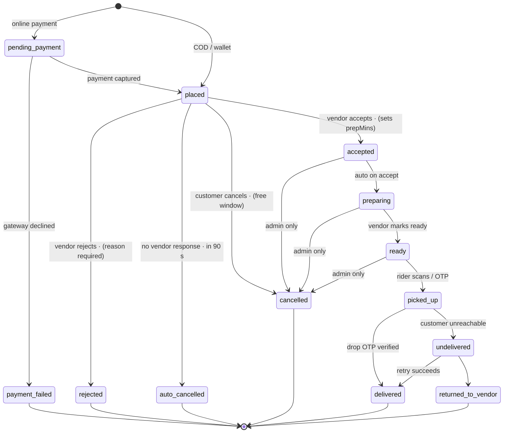
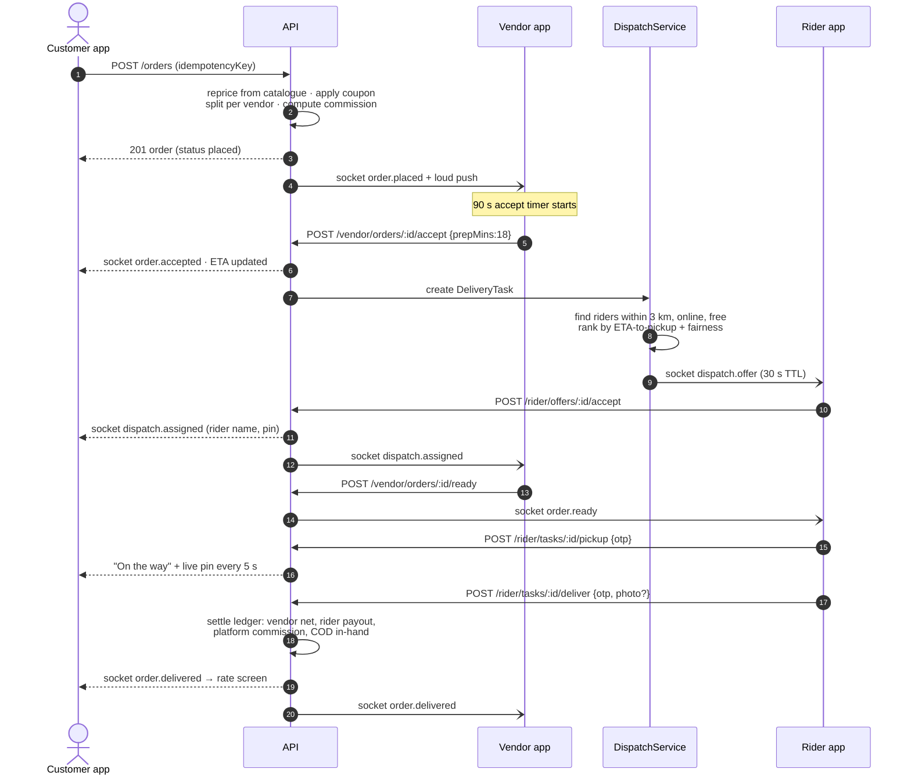
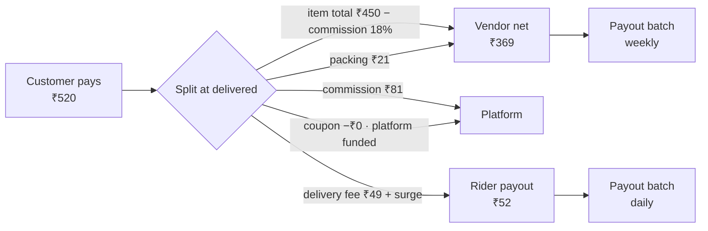

# 03 · Order Lifecycle

The current enum (`server/src/models/Order.js`) is:

```
placed → confirmed → preparing → out_for_delivery → delivered
                                                  ↘ cancelled
```

`admin.controller.js` enforces it forward-only with `STATUS_RANK`, and **only an admin can advance
it**. A customer may only cancel (`order.routes.js` allows `status: 'cancelled'` and nothing else).
That is a single-player model: it has no vendor accept/reject, no "food is ready", and no concept
of a rider at all.

## 3.1 Two state machines, not one

Mixing "is the food cooked" with "where is the rider" into one enum is the classic mistake — the
two progress independently (a rider can be waiting at the counter while the kitchen is still
cooking). Model them separately and derive the customer-facing label.

### A · Order fulfilment (owned by the vendor)



### B · Delivery task (owned by dispatch + rider)

```mermaid
stateDiagram-v2
  [*] --> unassigned: task created when · order is accepted
  unassigned --> offering: dispatch picks · nearest N riders
  offering --> assigned: a rider accepts
  offering --> unassigned: all rejected / · offer expired → widen radius
  offering --> manual: 3 rounds failed → · admin assigns by hand
  manual --> assigned

  assigned --> at_pickup: geofence 100 m · or rider taps Arrived
  at_pickup --> picked_up: pickup OTP verified
  picked_up --> at_drop: geofence at customer
  at_drop --> delivered: drop OTP + POD
  at_drop --> failed: customer unreachable · (3 call attempts logged)

  assigned --> reassigning: rider cancels / · goes unreachable 5 min
  reassigning --> offering
  delivered --> [*]
  failed --> [*]
```



## 3.2 What the customer sees

The customer app must not learn 15 states. Derive its timeline:

| Fulfilment | Delivery task | Customer label |
| --- | --- | --- |
| `placed` | – | "Waiting for restaurant to confirm" |
| `accepted` / `preparing` | `unassigned`/`offering` | "Preparing your order" |
| `preparing` / `ready` | `assigned`/`at_pickup` | "Rider arriving at restaurant" |
| `ready` | `at_pickup` | "Order ready, being collected" |
| `picked_up` | `picked_up`/`at_drop` | "On the way" + live pin |
| `delivered` | `delivered` | "Delivered" |
| `rejected`/`auto_cancelled`/`cancelled` | – | "Cancelled" + reason + refund state |

**Backwards compatibility (doc 02, migration step 3):** while the customer app is unchanged, keep
writing the legacy `status` field with this mapping — nothing in `AurasureApp/` breaks.

| New | Legacy value written |
| --- | --- |
| `pending_payment`, `placed` | `placed` |
| `accepted` | `confirmed` |
| `preparing`, `ready` | `preparing` |
| `picked_up`, `at_drop` | `out_for_delivery` |
| `delivered` | `delivered` |
| `rejected`, `auto_cancelled`, `cancelled`, `returned_to_vendor` | `cancelled` |

## 3.3 Who may perform which transition

Enforced server-side; the UI only hides buttons.

| Transition | Customer | Vendor | Rider | Admin | System |
| --- | :-: | :-: | :-: | :-: | :-: |
| place order | ✓ | | | | |
| cancel (free window ≤ 60 s, before accept) | ✓ | | | ✓ | |
| cancel after accept | ✗ (request only) | ✗ | | ✓ | |
| accept / reject | | ✓ | | ✓ | |
| auto-cancel on vendor timeout | | | | | ✓ |
| mark preparing → ready | | ✓ | | ✓ | |
| accept delivery offer | | | ✓ | | |
| mark picked up (OTP) | | | ✓ | ✓ | |
| mark delivered (OTP + POD) | | | ✓ | ✓ | |
| mark undelivered | | | ✓ | ✓ | |
| reassign rider | | | | ✓ | ✓ |
| refund | | | | ✓ | ✓ |

## 3.4 Happy path — end to end



## 3.5 The unhappy paths (each one needs a product decision)

| Scenario | Rule proposed |
| --- | --- |
| Vendor does not respond in 90 s | Auto-cancel, full instant refund, customer told "restaurant unavailable", vendor SLA counter +1. |
| Vendor rejects | Reason mandatory from a fixed list (`out_of_stock`, `too_busy`, `closing`, `item_unavailable`). Auto-refund. Suggest 3 alternatives in the customer app. |
| One item out of stock | Vendor may **partial-accept**: remove the line, API re-prices, customer gets a 60 s approve/cancel prompt. |
| No rider found after 3 offer rounds | Escalate to admin queue; if still nothing in 10 min, offer the customer "wait / cancel with full refund". |
| Rider cancels mid-task | Task → `reassigning`; the food is already cooked, so this must never cancel the order. |
| Customer unreachable at drop | 3 in-app calls logged, 8 min wait, then `undelivered`; disposition (return / dispose) decided by policy; partial charge per policy. |
| COD customer refuses to pay | Rider marks `failed_payment`, order `returned_to_vendor`, customer account flagged, COD not added to rider's in-hand. |
| Duplicate submit | `idempotencyKey` unique index → second request returns the first order. |
| Payment captured but order write fails | Gateway webhook is the source of truth; reconciliation job creates the order or auto-refunds within 15 min. |
| Vendor marks ready but rider never came | SLA alarm to admin at ready+15 min. |
| App killed mid-flow | Every mutation is idempotent and re-fetchable; the client always reconciles from `GET /orders/:id`. |

## 3.6 Money split per order



Every arrow is a `LedgerEntry` row (doc 02). Double-entry: the sum of debits and credits per order
must be zero — that invariant is what makes finance reports trustworthy, and it should be asserted
in a nightly job.
