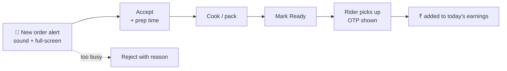
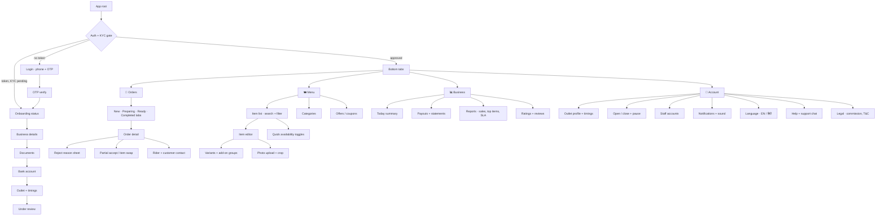

# 04 · Vendor App — Full Specification

> This is the app you build next. Nothing here is implemented yet.

**Name:** Aurasure Partner · **Stack:** Expo SDK 54 + React Native 0.81 (same as `AurasureApp/`),
TypeScript strict, React Navigation 7, shared `packages/ui`. **Package id:**
`com.aurasure.partner`. **Audience:** restaurant owners (food module) and store owners (shop
module) — one app, module-aware.

---

## 4.1 Personas & jobs-to-be-done

| Persona | Reality on the ground | Must be able to |
| --- | --- | --- |
| **Owner** (single outlet) | Runs the counter, phone in apron pocket, hands busy | Hear every new order, accept in one tap, close the shop when overwhelmed |
| **Manager / staff** | Operates the tablet at the pass | Work the order queue only — no bank details, no payout screen |
| **Multi-outlet owner** | 3–6 branches | Switch outlet, compare today's numbers, set per-outlet timings |
| **Catalogue person** | Adds dishes/products, often at night | Bulk-edit prices, upload photos, see what admin rejected and why |

Design consequences: **one-thumb operation**, huge tap targets, loud audible alerts, works on a
₹7,000 Android phone on 3G, and **Hindi + English** from day one.

## 4.2 The 20-second loop that must never break

Everything else in the app is secondary to this loop. If the app fails here, the vendor uninstalls
it and calls the ops team instead.

## 4.3 Navigation map

## 4.4 Screen-by-screen spec

Every screen lists: purpose → data in → actions → states. "States" always covers
**loading / empty / error / offline** because those are what actually ship broken.

### 4.4.1 Login (phone + OTP)

- **Data in:** none. **Out:** `POST /auth/vendor/otp/request { phone }` → `POST /auth/vendor/otp/verify { phone, code }` → `{ token, user, vendor }`.
- Rate-limited, 6-digit, 30 s resend timer, auto-read SMS on Android.
- **Error cases:** number not registered → "Apply to become a partner" deep link; account suspended → show support number; wrong OTP 5× → 15 min lock.
- Password login is *not* offered — vendors share phones, OTP is the safer default.

### 4.4.2 Onboarding / KYC (4 steps + review)

| Step | Fields | Validation |
| --- | --- | --- |
| Business | legal name, display name, module (food/shop), category, owner name, email | display name 3–60 chars, uniqueness checked server-side |
| Documents | GSTIN (opt), PAN, FSSAI (food, mandatory), shop photo, owner ID | file ≤ 5 MB, jpg/png/pdf, client-side compress, FSSAI regex + expiry date |
| Bank | account no. (×2 confirm), IFSC, holder name, cancelled cheque | IFSC lookup shows bank + branch before submit |
| Outlet | address + **map pin**, weekly hours, avg prep time, delivery radius | pin mandatory — this is what dispatch uses (doc 02) |

- **Review screen:** timeline `Submitted → Under review → Approved`, expected time, per-document status with the admin's rejection note inline and a Re-upload button.
- **Resumable:** every step saved as draft (`PATCH /vendor/onboarding`); killing the app loses nothing.

### 4.4.3 Orders — the board (default screen)

- **Tabs:** `New (n)` · `Preparing (n)` · `Ready (n)` · `Completed`.
- **Card shows:** order code, time ago, item count + first 2 items, total, payment badge (COD/Paid), distance, customer first name, **and a countdown ring on New**.
- **Actions:** Accept (opens prep-time picker: 10/15/20/30/custom), Reject (reason sheet), Mark Ready, Call rider, Print KOT.
- **Realtime:** `socket order.placed` → card slides in + alarm; falls back to 15 s poll of `GET /vendor/orders?status=new`.
- **The alert must survive:** screen off, app backgrounded, silent mode. Android: high-importance notification channel with a custom looping sound + full-screen intent; a foreground service while any order is in `New`. iOS: time-sensitive notification + critical alert entitlement (needs Apple approval — apply early).
- **States:** empty = "No live orders · you're open, we'll ping you"; offline = amber banner "Showing last synced 2 min ago" with a retry; error = inline retry, never a blank screen.

### 4.4.4 Order detail

Full item list with variants/add-ons and per-line notes, customer instructions (the API already
stores `instructions`), bill breakdown **as the vendor sees it** (item total, commission, your
net), payment method, delivery address (masked until picked up), rider block (name, phone via
masked call, live status), status timeline, and the **pickup OTP** once a rider is assigned.

Actions: Accept / Reject / Partial-accept (remove an item → customer re-approves, doc 03) / Mark
Ready / Print / Report a problem.

### 4.4.5 Menu / catalogue

- **List:** search, filter (available / unavailable / pending approval / rejected), section by category, drag to reorder.
- **Fast path:** long-press a row → "Out of stock for: 1 h / today / until I turn it on". This one interaction prevents most cancellations, so it must be reachable in ≤ 2 taps from the board.
- **Item editor:** name, description, price, MRP, veg/non-veg, prep time, photo (crop to 1:1, auto-compress to WebP like `AurasureApp` does), category, tags, variants (size → price delta), add-on groups (min/max select), stock qty (shop), availability schedule.
- **Moderation:** new items and price rises > 20 % go to `approvalStatus: pending`; show a clear pending/rejected badge with the reason.
- **Bulk:** multi-select → price ±%, availability, category move. CSV import in P1 for shop vendors with 500+ SKUs.

### 4.4.6 Business

- **Today:** orders, gross, net after commission, cancelled, average prep time, SLA breaches — a single scroll, no charts above the fold.
- **Payouts:** current cycle accrual, next payout date, past settlements with a downloadable PDF/CSV statement, per-order commission line items, adjustments (penalties, refunds) itemised. Disputes open a support ticket from the statement row.
- **Reports:** date-range sales, top/bottom items, hour-of-day heatmap, cancellation reasons, funnel (impressions → orders) once analytics exist.
- **Ratings:** average, distribution, latest reviews, one-tap reply, and flag-for-abuse.

### 4.4.7 Account & settings

Outlet profile, weekly timings + holiday mode, **open/closed toggle with a "pause for 15/30/60
min" option** (the single most-used control in Indian food ops), staff accounts with role
`vendor_staff` (orders-only), notification sound + volume test button, language, help centre,
support chat, commission agreement and invoices.

## 4.5 API surface the vendor app needs

Grouped by screen. `⊕` = new endpoint, `↻` = existing endpoint to extend. Full contract in doc 07.

| Screen | Method + path |
| --- | --- |
| Login | `⊕ POST /auth/vendor/otp/request` · `⊕ POST /auth/vendor/otp/verify` · `⊕ POST /auth/refresh` |
| Onboarding | `⊕ GET/PATCH /vendor/onboarding` · `⊕ POST /vendor/documents` (signed upload) |
| Session | `⊕ GET /vendor/me` (vendor + outlets + permissions) |
| Order board | `⊕ GET /vendor/orders?status=&outletId=&page=` · socket `vendor:{id}` |
| Order actions | `⊕ POST /vendor/orders/:id/accept {prepMins}` · `/reject {reason}` · `/ready` · `/partial-accept {removeLineIds}` |
| Order detail | `⊕ GET /vendor/orders/:id` |
| Menu | `⊕ GET /vendor/items` · `⊕ POST/PATCH /vendor/items/:id` · `⊕ PATCH /vendor/items/:id/availability` · `⊕ POST /vendor/items/bulk` |
| Media | `⊕ POST /vendor/uploads/sign` |
| Outlet | `⊕ PATCH /vendor/outlets/:id` (hours, pin, prep time) · `⊕ POST /vendor/outlets/:id/pause {minutes,reason}` |
| Business | `⊕ GET /vendor/stats?range=` · `⊕ GET /vendor/payouts` · `⊕ GET /vendor/payouts/:id/statement` |
| Ratings | `⊕ GET /vendor/ratings` · `⊕ POST /vendor/ratings/:id/reply` |
| Staff | `⊕ GET/POST/DELETE /vendor/staff` |
| Push | `⊕ POST /vendor/push-token` |

Every `/vendor/*` route sits behind `authenticate() + requireRole('vendor','vendor_staff') +
requireVendorScope()`. **Scope guard is mandatory:** the handler must filter by
`req.user.vendorId`, never by a `vendorId` taken from the request body — that is the classic
marketplace IDOR.

## 4.6 Non-functional requirements

| Area | Requirement |
| --- | --- |
| **Alert reliability** | New-order alert delivered in ≤ 3 s p95, audible with screen off. Weekly automated "did the vendor hear it" report. |
| Performance | Cold start ≤ 2.5 s on a Snapdragon 680; order board renders 200 orders without jank (FlashList). |
| Offline | Board readable offline from cache; accept/reject queued and replayed with idempotency keys; a clear "queued" badge, never a silent failure. |
| Battery | Foreground service only while orders are live, not 24×7. |
| Security | Token in `expo-secure-store`, 15 min access + 30 day refresh, auto-logout on role change, no PII in logs, customer phone always masked-called. |
| Accessibility | Min tap target 48 dp, dynamic type to 200 %, colour-blind-safe status colours (never colour alone). |
| i18n | English + Hindi at launch; strings externalised from commit #1 — retrofitting i18n is the classic rewrite trap. |
| Observability | Sentry + analytics events on every state transition; a funnel from `order.placed` to `order.ready` per vendor. |
| Testing | Detox e2e for the accept→ready loop; unit tests on the offline queue; a staging "fake order" button for vendors to test their sound. |

## 4.7 Build phases

```mermaid
gantt
  title Vendor app delivery plan
  dateFormat X
  axisFormat %s
  section P0 · make it usable (4–5 wks)
  Backend: Vendor/Outlet models + scope guard   :0, 10
  OTP auth + KYC submit + review screen          :5, 8
  Order board + accept/reject/ready              :8, 10
  Push + loud alert + foreground service         :12, 6
  Item availability quick toggle                 :16, 4
  section P1 · make it complete (4–6 wks)
  Full menu CRUD + variants + photos             :20, 10
  Payouts, statements, commission                :24, 8
  Reports + ratings + reply                      :30, 6
  Staff accounts + permissions                   :34, 4
  section P2 · make it grow
  Multi-outlet switcher, offers, ads, POS/KOT, CSV import :38, 12
```

**P0 exit criteria:** a real vendor, on their own phone, receives and completes 20 consecutive
orders without an ops phone call, and the money on their statement matches the orders exactly.

## 4.8 Open decisions (need your call before build)

1. **Commission model** — flat % per order, or slab by category / order value? Affects `Vendor.commissionPct` and every payout screen.
2. **Who funds coupons** — platform, vendor, or shared? Changes the bill breakdown the vendor sees.
3. **Self-serve signup or invite-only** — does the KYC flow exist publicly on day one, or does ops create vendors and the app is approved-only?
4. **Menu moderation** — every edit reviewed, or only new items and big price rises (my recommendation)?
5. **Vendor-managed delivery** — can a vendor use their own delivery boy for some orders, or is fleet always Aurasure's? This decides whether `DeliveryTask` is optional.
6. **Tablet layout** — most serious kitchens use a 10" tablet at the pass. Ship phone-only in P0 and add a two-pane tablet layout in P1?
