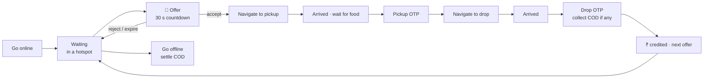
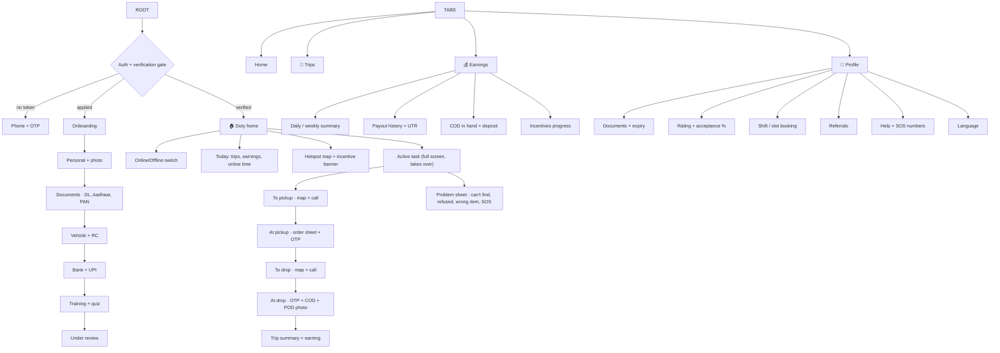
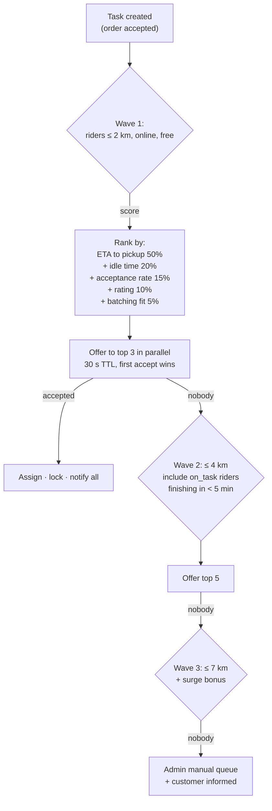

# 05 · Delivery Partner App — Full Specification

**Name:** Aurasure Rider · **Stack:** Expo SDK 54 + RN 0.81 with a custom dev client (background
location and a foreground service need native config — Expo Go will not do). **Package id:**
`com.aurasure.rider`.

This is the hardest of the three apps: it runs for 10 hours a day, in a pocket, on 3G, in the sun,
on a phone with 12 % battery. Every design choice below follows from that.

---

## 5.1 The rider's day

## 5.2 Navigation map

## 5.3 Screen specs (the ones that carry risk)

### 5.3.1 Duty toggle

- One switch, impossible to miss, with a clear reason when it refuses: documents expired, COD limit
  exceeded, outside operating hours, zone full.
- Going online starts location tracking; going offline stops it. **Never track a rider who is
  offline** — it is both a privacy and a Play Store policy issue, and it drains battery.
- Auto-offline after 15 min of no movement + no task, with a confirm prompt (prevents phantom
  supply in the dispatch pool).

### 5.3.2 Offer card

- Full-screen takeover with sound + vibration, even over other apps.
- Shows: pickup name + distance, drop area (not full address), total trip km, **guaranteed
  payout**, COD amount if any, 30 s ring countdown.
- Accept = single big button. Reject asks a reason (optional, 3 taps max).
- **Offer locking:** the same task must never be double-accepted — Redis lock keyed by task id,
  first accept wins, others get "Order taken by another partner" (doc 01, `Redis`).
- Acceptance rate is tracked but **must not** be punitive at MVP; show it, don't penalise, until
  supply is healthy.

### 5.3.3 Active task

- The app is single-tasking here: one screen, one primary action, big.
- Map with route, "Navigate" hands off to Google Maps, in-app **masked calling** to vendor and
  customer (never expose real numbers).
- Arrived is auto-suggested by a 100 m geofence but always manually confirmable (GPS drifts indoors
  and in markets).
- **Pickup OTP** typed by the rider from the vendor's screen; **drop OTP** from the customer.
  Fallback: if the customer has no phone signal, a "verify by name + last 4 digits" path with an
  admin flag on the order.
- Proof of delivery photo mandatory for `leave at door` and for all orders above ₹2,000.

### 5.3.4 Earnings & COD

- Today / this week: trip pay + incentive + tips − deductions, with each trip expandable.
- **COD in hand** is a first-class number with a hard limit (e.g. ₹3,000): crossing it blocks new
  COD offers until deposited. Deposit flows: UPI to platform, or cash at a hub with a QR receipt.
- Payout history with UTR and a dispute button.

### 5.3.5 Safety

SOS button on the active-task screen → calls the emergency line, shares live location with ops,
logs an incident. Night-shift check-ins. Insurance details visible in profile. This is not optional
polish; it is what makes riders trust the platform.

## 5.4 Dispatch algorithm (server-side, `DispatchService`)

Tunable constants live in `Zone.feeRules`, not in code. Log every wave so ops can see *why* an
order waited.

**Batching (P2):** two orders may share a rider only if both pickups are within 500 m, drops within
1 km of each other, and the second drop adds < 8 min. Never batch a food order that is already
late.

## 5.5 Location tracking — the part that breaks in production

| Concern | Approach |
| --- | --- |
| Library | `expo-location` with `startLocationUpdatesAsync` + a TaskManager background task; Android foreground service with a persistent "Aurasure is tracking your delivery" notification. |
| Frequency | On task: every 5 s / 20 m. Idle online: every 60 s / 200 m. Offline: **never**. |
| Battery | Balanced accuracy when idle, high accuracy only on an active task; batch-upload pings every 15 s in one request. |
| Network loss | Ring buffer of the last 200 pings on device, flushed when connectivity returns; timestamps are client-side and server-validated. |
| OEM killers | Xiaomi/Oppo/Vivo aggressively kill background apps — ship an in-app "Fix battery settings" guide with per-OEM deep links, and detect a killed service to warn the rider. |
| Privacy & policy | Play Store background-location declaration + a demo video are required for approval. Budget 2 weeks. Prominent in-app disclosure before the first permission prompt. |
| Storage | Write pings to a capped/TTL collection or a time-series collection, not into `Rider` — a 500-rider fleet writes ~4 M pings a day. |

## 5.6 API surface

| Screen | Method + path |
| --- | --- |
| Auth | `⊕ POST /auth/rider/otp/request` · `/verify` · `POST /auth/refresh` |
| Onboarding | `⊕ GET/PATCH /rider/onboarding` · `⊕ POST /rider/documents` |
| Session | `⊕ GET /rider/me` |
| Duty | `⊕ POST /rider/duty {state}` |
| Location | `⊕ POST /rider/location/batch [{lat,lng,at,speed,accuracy}]` |
| Offers | socket `dispatch.offer` · `⊕ POST /rider/offers/:id/accept` · `/reject` |
| Task | `⊕ GET /rider/tasks/active` · `⊕ POST /rider/tasks/:id/arrived-pickup` · `/pickup {otp}` · `/arrived-drop` · `/deliver {otp, podUrl?, codCollected}` · `/fail {reason}` |
| History | `⊕ GET /rider/tasks?from=&to=` |
| Earnings | `⊕ GET /rider/earnings?range=` · `⊕ GET /rider/payouts` · `⊕ POST /rider/cod/deposit` |
| Incentives | `⊕ GET /rider/incentives` |
| Safety | `⊕ POST /rider/sos` |
| Push | `⊕ POST /rider/push-token` |

## 5.7 Non-functional requirements

| Area | Requirement |
| --- | --- |
| Offer latency | Push + socket delivered in ≤ 2 s p95; the 30 s countdown starts on **server** time, not device time. |
| Battery | ≤ 8 % per hour on an active task on a mid-range Android. Measured in CI on a real device before every release. |
| Data | ≤ 40 MB/day. Map tiles cached; no auto-playing media anywhere. |
| Offline | Every task action queues locally with an idempotency key and replays in order. A rider in a basement must still be able to tap "Delivered". |
| Anti-fraud | Detect mock locations, impossible speed jumps, OTP shared over phone (flag when pickup and drop OTP are entered from the same coordinates), and selfie checks at duty start (P2). |
| Accessibility | Everything reachable one-handed with gloves; primary buttons ≥ 56 dp; high-contrast outdoor mode. |
| i18n | Hindi first, English second — invert the customer app's default. |

## 5.8 Phases

- **P0 (5–6 wks):** OTP auth, KYC submit, duty toggle, single-order offer→accept→pickup OTP→drop OTP→delivered, location tracking, today's earnings, trip history. Manual admin assignment as a fallback from day one.
- **P1 (4 wks):** auto-dispatch waves, COD in-hand + deposit, payouts + UTR, incentives, ratings, masked calling, SOS, problem/failure flows.
- **P2:** batching, shift booking, heatmaps, gamification, selfie check, referral programme.

## 5.9 Open decisions

1. **Employment model** — gig (per trip) or salaried shifts? Changes earnings, slot booking and payout entirely.
2. **Rider payout formula** — base + per-km + surge + tips. Need the actual numbers before the earnings screen can be designed honestly.
3. **COD limit and deposit channel** — UPI-only, or physical hubs?
4. **Zones on day one** — one city one zone (simplest) or polygon zones from the start?
5. **Who owns the customer relationship on failure** — rider decides return/dispose, or always ops?
