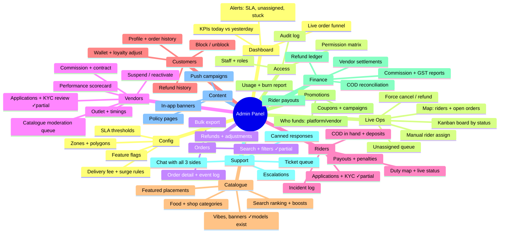
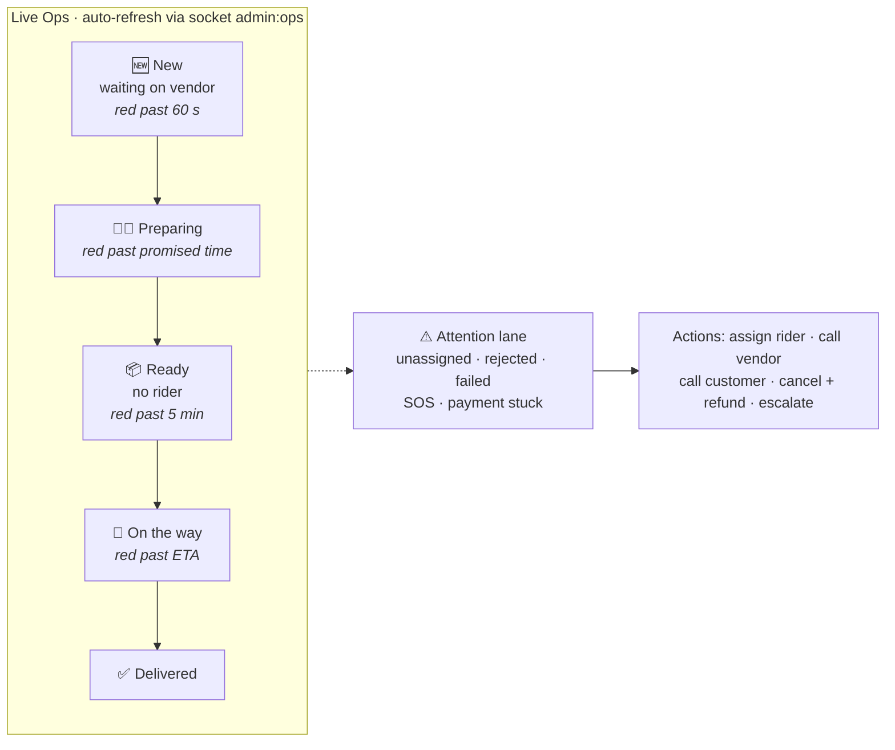

# 06 · Admin Panel — Full Specification

**Stack:** Next.js (App Router) + TypeScript + TanStack Query + a table-heavy component kit, in
`admin-web/`. Auth: same JWT, `role in (admin, support, finance, catalogue_ops)`.

Today's in-app console (`AurasureApp` + `server/src/controllers/admin.controller.js`) covers
exactly three things: stats, list/advance orders, approve/reject partner applications. That is
~10 % of what a marketplace needs. Below is the full target, with the existing pieces marked.

---

## 6.1 Module map

## 6.2 The screen that matters: Live Ops board

Every card: order code, age timer, vendor, rider, customer, value, and a one-click action. Colour
is never the only signal — each state also carries an icon and a text label.

## 6.3 Permission matrix

| Capability | admin | support | finance | catalogue_ops | vendor | rider |
| --- | :-: | :-: | :-: | :-: | :-: | :-: |
| View any order | ✓ | ✓ | ✓ | – | own | own |
| Force status / cancel | ✓ | ✓ | – | – | – | – |
| Issue refund ≤ ₹1,000 | ✓ | ✓ | ✓ | – | – | – |
| Issue refund > ₹1,000 | ✓ | – | ✓ | – | – | – |
| Approve vendor KYC | ✓ | – | – | ✓ | – | – |
| Approve rider KYC | ✓ | – | – | – | – | – |
| Edit commission | ✓ | – | ✓ | – | – | – |
| Run payout batch | ✓ | – | ✓ | – | – | – |
| Moderate catalogue | ✓ | – | – | ✓ | own | – |
| Adjust customer wallet | ✓ | ✓ | ✓ | – | – | – |
| Manage staff + roles | ✓ | – | – | – | – | – |
| View audit log | ✓ | – | ✓ | – | – | – |

Implemented as `requireRole(...)` plus a `can(permission)` helper — role-only checks stop scaling
the moment finance needs refunds but not KYC.

## 6.4 Non-negotiables

| Area | Requirement |
| --- | --- |
| **Audit log** | Every mutating admin action writes `{actor, action, target, before, after, ip, at}`. There is none today — an admin can change any order status leaving no trace. Immutable, exportable, searchable. |
| Two-person rule | Payout batches and refunds > ₹10,000 require a second approver. |
| Session security | Admin JWT ≤ 8 h, mandatory 2FA (TOTP), IP allow-list optional, forced logout on role change. |
| PII | Customer phone masked by default with a "reveal" that is itself audit-logged. |
| Exports | Every table exports CSV; every export is logged (data-exfiltration trail). |
| Realtime | Live Ops via socket, everything else on TanStack Query with a 30 s stale time. |
| Bulk safety | Destructive bulk actions need typed confirmation and are capped per batch. |
| Reporting | Nightly rollups into a `DailyStats` collection — never run dashboard aggregations over the raw `Order` collection at scale (the current `admin.controller.getStats` does exactly that and will get slow around ~100 k orders). |

## 6.5 What already exists vs what is new

| Capability | Today | Action |
| --- | --- | --- |
| `GET /admin/stats` | ✓ live aggregation | Keep for now; move to nightly rollups later |
| `GET /admin/orders` + filters | ✓ module/status/pagination | Extend: vendor, rider, date range, text search |
| `PATCH /admin/orders/:id/status` | ✓ forward-only via `STATUS_RANK` | Extend to the new state machine (doc 03) + write `OrderEvent` |
| `GET /admin/partners`, `PATCH /admin/partners/:userId` | ✓ approve/reject the `partnerApplication` blob | Replace with real vendor/rider KYC review incl. documents |
| Everything else in 6.1 | ✗ | New |

## 6.6 Phases

- **P0:** dashboard, live ops board, order detail + force actions, vendor KYC review, rider KYC review, manual rider assignment, audit log. (Manual assignment is what lets the rider app ship before auto-dispatch exists.)
- **P1:** finance (settlements, payouts, COD reconciliation), catalogue moderation, customer support tools, refunds with approval rules.
- **P2:** promotions engine, push campaigns, zones + surge config, analytics warehouse, feature flags.
