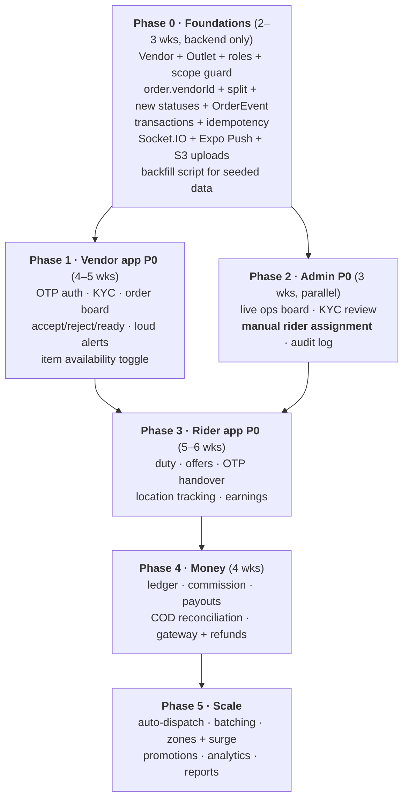

# 08 · Gap Analysis — every problem, ranked

What actually blocks a Vendor app, a Rider app and a real Admin panel today. Each row is grounded
in the current code. **Read this before writing any feature code.**

Severity: 🔴 blocker (nothing works without it) · 🟠 major (ships broken without it) · 🟡 important
(hurts within weeks) · ⚪ hygiene.

## 8.1 Domain model

| # | Problem | Where | Sev | Fix |
| --- | --- | --- | :-: | --- |
| 1 | **No `Vendor` entity.** Restaurants and stores belong to nobody, so "my orders" / "my menu" cannot be expressed. | `models/Restaurant.js`, `models/ShopStore.js` | 🔴 | New `Vendor` + `Outlet` collections, `vendorId` on both (doc 02). |
| 2 | **Orders are not linked to a vendor.** `Order` has `user`, `module`, `items[]` with `refId` — deriving the vendor means loading every item. | `models/Order.js` | 🔴 | Add `vendorId` + `outletId`, indexed, stamped at creation. |
| 3 | **A cart can mix vendors.** Two restaurants in one order is unfulfillable. | `controllers/order.controller.js` | 🔴 | Split into one `Order` per vendor under an `OrderGroup`; or block mixing in the cart. Decide before the vendor app. |
| 4 | **No delivery domain at all.** No rider, no task, no assignment, no location. | everywhere | 🔴 | `Rider`, `DeliveryTask`, `TaskOffer` (doc 02). |
| 5 | **`partnerApplication` is a Mixed blob** — `{kind, name, city, appliedAt, status}`. No documents, no bank, no vehicle, not queryable, no per-document decisions. | `models/User.js`, `controllers/user.controller.js` | 🟠 | Real KYC sub-documents on `Vendor` / `Rider`; migrate and freeze the blob. |
| 6 | **Roles are only `customer\|admin`.** | `models/User.js` | 🔴 | Extend the enum; `requireRole()` already takes a list. |
| 7 | **No geo data.** `distanceKm` is a static seeded number; there is no coordinate anywhere. Dispatch, "near me" and delivery fees are all impossible. | `models/Restaurant.js` | 🔴 | GeoJSON `Point` + `2dsphere` on `Outlet` and `Rider`. |
| 8 | **No inventory.** `Product.inStock` is a boolean; `FoodItem` has no availability field at all. | `models/Product.js`, `models/FoodItem.js` | 🟠 | `isAvailable` + `unavailableUntil` + optional `stockQty`; decrement inside the order transaction. |
| 9 | **No variants / add-ons.** Only `sizes[]` and `colors[]` string arrays; food has nothing. Real menus need "Large +₹60, extra cheese +₹30". | `models/Product.js` | 🟡 | `variants[]` + `addOnGroups[]`, and cart lines must carry the selection. |

## 8.2 Order flow

| # | Problem | Where | Sev | Fix |
| --- | --- | --- | :-: | --- |
| 10 | **Status enum has no vendor or rider states** — no accept, reject, ready, picked-up. | `models/Order.js` | 🔴 | New state machine + legacy mapping (doc 03). |
| 11 | **Only admin can advance an order**; the customer may only cancel. A vendor literally cannot act. | `routes/admin.routes.js`, `routes/order.routes.js` | 🔴 | `/vendor/*` and `/rider/*` transitions with a server-side permission table (doc 03.3). |
| 12 | **No timeout on vendor acceptance.** An order can sit in `placed` forever. | – | 🟠 | 90 s auto-cancel job + full refund. |
| 13 | **No event log.** `updatedAt` keeps only the last change; nobody can answer "who cancelled this and when". | `models/Order.js` | 🟠 | `OrderEvent` append-only trail. |
| 14 | **No idempotency.** Double-tapping Place Order creates two orders and charges the wallet twice. | `controllers/order.controller.js` | 🟠 | `Idempotency-Key` + unique sparse index. |
| 15 | **Wallet debit + order insert are not atomic.** `user.save()` and `Order.create()` are separate awaits with no transaction — a crash between them loses money or creates a free order. | `controllers/order.controller.js` | 🔴 | Mongo multi-document transaction (Atlas replica set required) or a compensating outbox. |
| 16 | **No partial acceptance / substitution**, yet the cart already collects an "if unavailable" instruction that nothing acts on. | `models/Order.js` (`instructions`) | 🟡 | Partial-accept endpoint + customer re-approval. |
| 17 | **No OTP or proof at handover.** Nothing verifies that the right person received the order. | – | 🟠 | Pickup + drop OTP on `DeliveryTask`, POD photo above a threshold. |

## 8.3 Money

| # | Problem | Where | Sev | Fix |
| --- | --- | --- | :-: | --- |
| 18 | **No commission, no payouts, no settlement.** The platform earns nothing and vendors/riders cannot be paid. | – | 🔴 | `LedgerEntry` (double-entry) + `Payout` batches (doc 02, 03.6). |
| 19 | **Money is floats.** Already patched with `Math.round(x*100)/100`; commission splits will drift. | `models/Order.js`, `controllers/order.controller.js` | 🟠 | Integer paise everywhere new; dual-write during migration. |
| 20 | **No real payment gateway.** `payBy` is `wallet\|cod\|upi\|card` with no gateway state, no webhook, no refund object — UPI/card are effectively fake. | `models/Order.js` | 🟠 | Gateway integration + webhook as the source of truth + a reconciliation job. |
| 21 | **No refund trail.** Cancellation refunds the wallet but records no refund entity, so finance cannot audit. | `controllers/order.controller.js` | 🟡 | `payment.refunds[]` + ledger rows. |
| 22 | **No COD handling.** Cash collected by a rider is untracked — the single biggest leak in Indian delivery. | – | 🟠 | `Rider.codInHand`, deposit flow, limits (doc 05.3.4). |

## 8.4 Platform & operations

| # | Problem | Where | Sev | Fix |
| --- | --- | --- | :-: | --- |
| 23 | **Nothing is realtime.** REST polling only. A vendor cannot poll fast enough to hear an order. | whole API | 🔴 | Socket.IO + Redis adapter, push fallback (doc 01.3). |
| 24 | **No push notifications** anywhere. | – | 🔴 | Expo Push + per-app tokens + high-importance channels. |
| 25 | **No admin audit log.** An admin can change any order and leave no trace. | `controllers/admin.controller.js` | 🟠 | Immutable audit collection on every mutation. |
| 26 | **No refresh tokens.** One long-lived JWT; no revocation, no rotation, no logout-everywhere. | `controllers/auth.controller.js` | 🟠 | Access 15 min + rotating refresh with reuse detection. |
| 27 | **No OTP login server-side** although the customer app already shows an OTP screen. | `routes/auth.routes.js` | 🟠 | Real OTP service + SMS provider. |
| 28 | **Dashboard aggregates the raw `Order` collection on every call.** Fine at 5 k orders, slow at 100 k. | `admin.controller.getStats` | 🟡 | Nightly `DailyStats` rollups. |
| 29 | **Global rate limit only**, so one noisy client can throttle vendors. | `app.js` | 🟡 | Per-role, per-route limits. |
| 30 | **No file upload pipeline.** Vendor photos and rider documents have nowhere to go. | – | 🟠 | S3 + signed URLs + virus scan + image pipeline. |
| 31 | **No background job runner.** Auto-cancel, dispatch waves, payout batches and reconciliation all need scheduling. | – | 🟠 | BullMQ on Redis (or Agenda on Mongo for a smaller footprint). |
| 32 | **No test suite on the server.** Only `scripts/smoke.js` + syntax checks. Four clients on one API without tests will regress weekly. | `server/scripts/` | 🟠 | Jest + supertest on the state machine, money maths and scope guards, in CI. |
| 33 | **Single instance assumptions.** Sockets and in-memory locks break the moment there are two pods. | – | 🟡 | Redis adapter + distributed locks from the start. |

## 8.5 Product decisions still open

These are not code problems — they are choices only you can make, and each one changes the schema.

1. **Multi-vendor cart:** split orders, or one vendor per cart?
2. **Commission:** flat % or slabs? Who funds coupons?
3. **Fleet:** platform-only riders, or may vendors self-deliver?
4. **Payments:** COD-first (simplest, matches the current model) or online-first?
5. **Coverage:** one city one zone, or polygon zones from day one?
6. **Vendor onboarding:** self-serve or invite-only?
7. **Rider engagement:** gig per-trip or shift-based?
8. **Catalogue moderation:** all edits, or only new items + big price rises?
9. **SLA policy:** what happens to a vendor after N late orders — warning, ranking penalty, suspension?
10. **Refund policy:** who eats the cost when a vendor rejects — platform or vendor?

## 8.6 Recommended build order

**Why this order:** Phase 0 is unavoidable — every app depends on it. Admin's manual assignment
(Phase 2) is deliberately before the rider app, because it lets vendors go live with ops-driven
dispatch while the rider app is still being built. Money (Phase 4) comes after the flow works
end-to-end, but before real vendors are onboarded at scale — you cannot ask a vendor to trust a
statement that does not exist yet.
